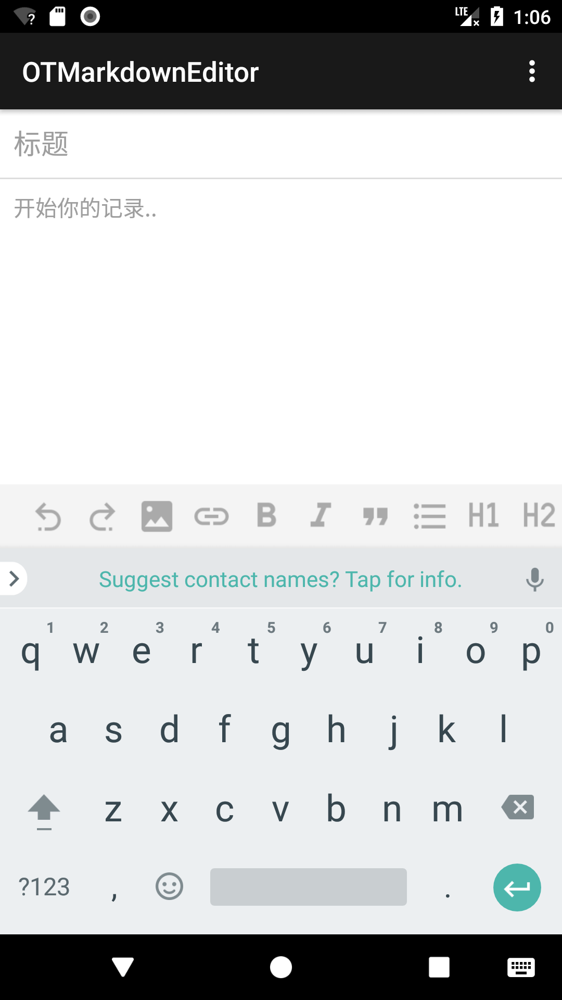
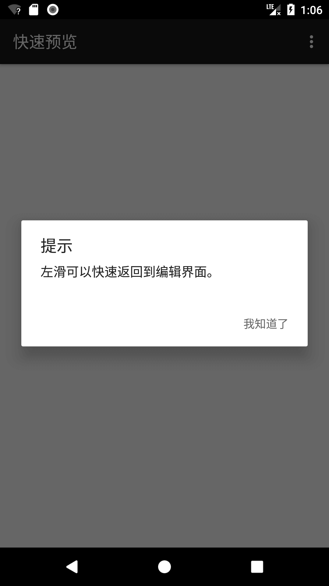
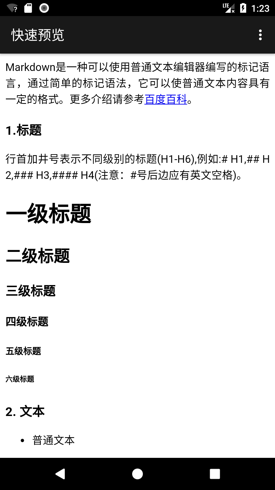

# OTMarkdownEditor

Android Markdown编辑器

For [旧时光](http://jiushig.com)

## Screenshot 
     


## Setup

To use this library your `minSdkVersion` must be >= 19

Add it in your root build.gradle at the end of repositories

```gradle
allprojects {
    repositories {
        ...
        maven { url 'https://www.jitpack.io' }
    }
}
```
Add the dependency
```gradle
dependencies {
        compile 'com.github.xia-weiyang:OTMarkdownEditor:1.1.beta3'
}
```

## Usage

#### Markdown 解析

```xml
<com.jiushig.markdown.widget.MarkdownView
    android:id="@+id/markdownView"
    android:layout_width="match_parent"
    android:layout_height="match_parent" />
```

```java
MarkdownView markdownView = (MarkdownView) findViewById(R.id.markdownView);
markdownView.setTextInBackground(markdownString);
```

链接点击
```java
markdownView.setLinkClickListener(new MarkdownView.LinkClickListener() {
    @Override
    public void click(String url) {
    }
});
```

图片点击
```java
markdownView.setImgClickListener(new MarkdownView.ImgClickListener() {
    @Override
    public void click(String[] urls, int index) {
    }
});
```

#### Markdown 编辑器

继承EditorActivity实现编辑器功能

```java
public class MainActivity extends EditorActivity {

    @Override
    protected void onCreate(@Nullable Bundle savedInstanceState) {
        super.onCreate(savedInstanceState);
    }

    /**
    * 点击了保存
    */
    @Override
    protected void clickSave(String title, String text) {
        super.clickSave(title, text);
    }
}
```

Look at the sample app or markdown for more.

### Thanks
- [https://github.com/vsch/flexmark-java](https://github.com/vsch/flexmark-java)
- [https://github.com/qinci/AndroidEdit](https://github.com/qinci/AndroidEdit)
- [https://github.com/jasonm23/markdown-css-themes](https://github.com/jasonm23/markdown-css-themes)

### License

```
Copyright (C) 2017 xia-weiyang

Licensed under the Apache License, Version 2.0 (the "License");
you may not use this file except in compliance with the License.
You may obtain a copy of the License at

   http://www.apache.org/licenses/LICENSE-2.0

Unless required by applicable law or agreed to in writing, software
distributed under the License is distributed on an "AS IS" BASIS,
WITHOUT WARRANTIES OR CONDITIONS OF ANY KIND, either express or implied.
See the License for the specific language governing permissions and
limitations under the License.
```
